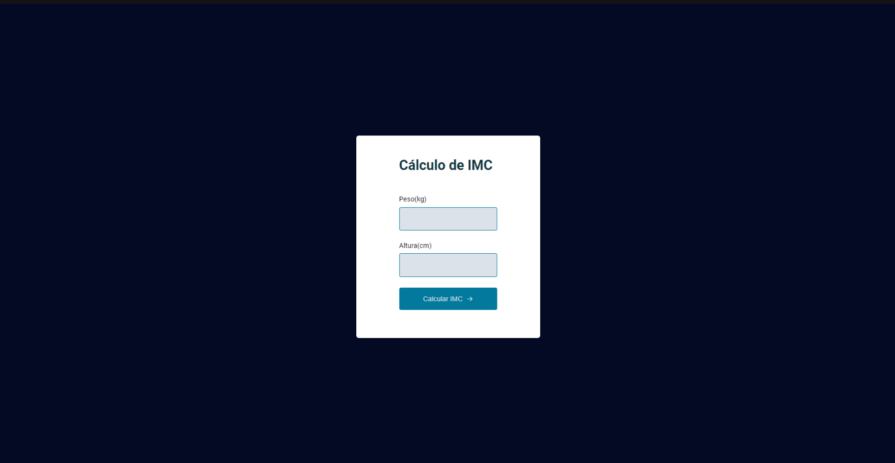
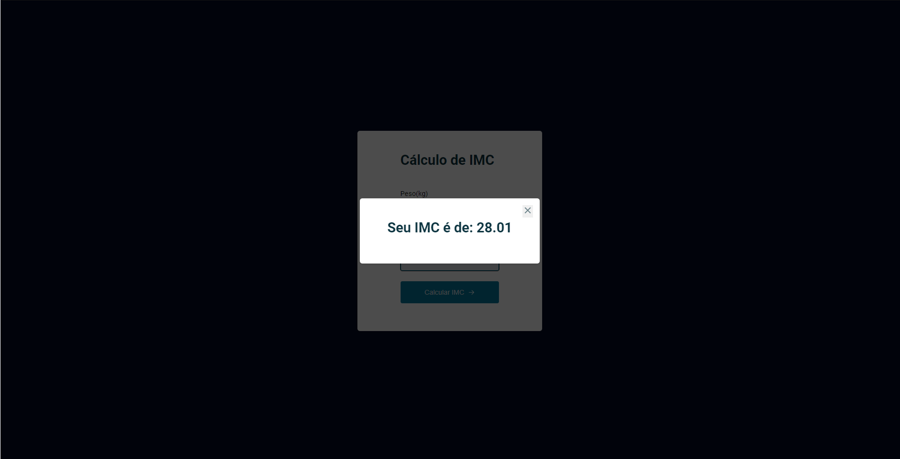

<h1 align="center"> Imc Calculator</h1>

Its a Java Scrpit pure project with E6 modules, that calculates any IMC person.  

  <a href="#-tecnologias">Techs/Tecnologias</a>&nbsp;&nbsp;&nbsp;|&nbsp;&nbsp;&nbsp;
  <a href="#-projeto">Project/Projeto</a>&nbsp;&nbsp;&nbsp;|&nbsp;&nbsp;&nbsp;
  <a href="#-layout">Layout</a>&nbsp;&nbsp;&nbsp;|&nbsp;&nbsp;&nbsp;
  <a href="#memo-licença">License/Licença</a>

  

  

## 🚀 Techs / Tecnologias

Esse projeto foi desenvolvido com as seguintes tecnologias:

- HTML e CSS
- JavaScript
- Git e Github

## 💻 Project / Projeto

O projeto foi desenvolvido para calcular o Imc de qualquer pessoa, possui uma resposta simples.

The project was developed to calculate anyone's BMI, it has a simple classification response.

## 🔖 Layout

Você pode visualizar o layout do projeto através do repositório. 

Feito com amor por Lara.
Made w/ love by Lara.